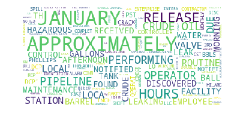

Internet page with example for doing wordcloud in python:

https://www.kaggle.com/adiljadoon/word-cloud-with-python


```python
import pandas as pd
df1 = pd.read_csv('https://query.data.world/s/dv2xwja6ue6tmbcqbst5dnilexrip4')
# dataset is at kaggle - https://data.world/webmadster/phmsa-hazardous-liquid-accident-data-since-2010
```

    /srv/conda/lib/python3.6/site-packages/IPython/core/interactiveshell.py:2728: DtypeWarning: Columns (62,64,65,66,67,68,69,73,75,77,78,79,80,82,90,91,103,105,118,138,139,140,172,182,183,184,185,210,212,226,228,229,240,245,249,253,264,271,273,284,288,290,292,294,296,297,302,308,310,318,322,323,335,337,341,343,371,372,375,376,381,383,385,390,401,408,409,410,411,413,415,430,431,434,437,451,462,468,469,475,476,477,480,481,482,498,504,506,508,509,516,522,524,526,529,530,531,535,536,537,545,548,551,553,554,576) have mixed types. Specify dtype option on import or set low_memory=False.
      interactivity=interactivity, compiler=compiler, result=result)


```python
df1.head()
```


<div>
<style scoped>
    .dataframe tbody tr th:only-of-type {
        vertical-align: middle;
    }

    .dataframe tbody tr th {
        vertical-align: top;
    }

    .dataframe thead th {
        text-align: right;
    }
</style>
<table border="1" class="dataframe">
  <thead>
    <tr style="text-align: right;">
      <th></th>
      <th>REPORT_RECEIVED_DATE</th>
      <th>IYEAR</th>
      <th>REPORT_NUMBER</th>
      <th>SUPPLEMENTAL_NUMBER</th>
      <th>REPORT_TYPE</th>
      <th>OPERATOR_ID</th>
      <th>NAME</th>
      <th>OPERATOR_STREET_ADDRESS</th>
      <th>OPERATOR_CITY_NAME</th>
      <th>OPERATOR_STATE_ABBREVIATION</th>
      <th>...</th>
      <th>PREPARER_TITLE</th>
      <th>PREPARER_EMAIL</th>
      <th>PREPARER_TELEPHONE</th>
      <th>PREPARER_FAX</th>
      <th>PREPARED_DATE</th>
      <th>AUTHORIZER_NAME</th>
      <th>AUTHORIZER_TITLE</th>
      <th>AUTHORIZER_TELEPHONE</th>
      <th>AUTHORIZER_EMAIL</th>
      <th>NARRATIVE</th>
    </tr>
  </thead>
  <tbody>
    <tr>
      <th>0</th>
      <td>2/27/2018</td>
      <td>2018</td>
      <td>20180064</td>
      <td>23185</td>
      <td>ORIGINAL FINAL</td>
      <td>31618</td>
      <td>ENTERPRISE PRODUCTS OPERATING LLC</td>
      <td>1100 LOUISIANA STREET</td>
      <td>HOUSTON</td>
      <td>TX</td>
      <td>...</td>
      <td>SR. PIPELINE COMPLIANCE ENGINEER</td>
      <td>rsromero@eprod.com</td>
      <td>713-381-6841</td>
      <td>NaN</td>
      <td>2/27/2018</td>
      <td>RICHARD S ROMERO</td>
      <td>SR. PIPELINE COMPLIANCE ENGINEER</td>
      <td>713-381-6841</td>
      <td>rsromero@eprod.com</td>
      <td>ON 2/19/2018 AN EMPLOYEE OF PHILLIPS 66 NOTIFI...</td>
    </tr>
    <tr>
      <th>1</th>
      <td>2/20/2018</td>
      <td>2018</td>
      <td>20180058</td>
      <td>23160</td>
      <td>ORIGINAL FINAL</td>
      <td>30829</td>
      <td>ENTERPRISE CRUDE PIPELINE LLC</td>
      <td>1100 LOUISIANA STREET</td>
      <td>HOUSTON</td>
      <td>TX</td>
      <td>...</td>
      <td>NaN</td>
      <td>candress@eprod.com</td>
      <td>713-381-6426</td>
      <td>NaN</td>
      <td>2/20/2018</td>
      <td>CHASE ANDRESS</td>
      <td>PIPELINE COMPLIANCE</td>
      <td>713-381-6462</td>
      <td>candress@eprod.com</td>
      <td>ON 2-10-18 AT APPROXIMATELY 22:20 LOCAL OPERAT...</td>
    </tr>
    <tr>
      <th>2</th>
      <td>2/14/2018</td>
      <td>2018</td>
      <td>20180042</td>
      <td>23135</td>
      <td>ORIGINAL FINAL</td>
      <td>30829</td>
      <td>ENTERPRISE CRUDE PIPELINE LLC</td>
      <td>1100 LOUISIANA STREET</td>
      <td>HOUSTON</td>
      <td>TX</td>
      <td>...</td>
      <td>NaN</td>
      <td>candress@eprod.com</td>
      <td>713-381-6426</td>
      <td>NaN</td>
      <td>2/14/2018</td>
      <td>CHASE ANDRESS</td>
      <td>PIPELINE COMPLIANCE</td>
      <td>713-381-6426</td>
      <td>candress@eprod.com</td>
      <td>ON 02-07-18 AT 12:27 PIPELINE CONTROL RECEIVED...</td>
    </tr>
    <tr>
      <th>3</th>
      <td>2/28/2018</td>
      <td>2018</td>
      <td>20180066</td>
      <td>23190</td>
      <td>ORIGINAL</td>
      <td>39534</td>
      <td>TORRANCE VALLEY PIPELINE COMPANY LLC</td>
      <td>1 SYLVAN WAY 2ND FLOOR</td>
      <td>PARSIPPANY</td>
      <td>NJ</td>
      <td>...</td>
      <td>REGULATORY ADVISOR</td>
      <td>thomas.slosson@pbfenergy.com</td>
      <td>310-212-1764</td>
      <td>NaN</td>
      <td>2/28/2018</td>
      <td>THOMAS MCLANE</td>
      <td>DIRECTOR OF REGULATORY COMPLIANCE</td>
      <td>281-661-4224</td>
      <td>thomas.mclane@pbfenergy.com</td>
      <td>AT APPROXIMATELY 10:45 AM PST, AN OPERATOR AT ...</td>
    </tr>
    <tr>
      <th>4</th>
      <td>2/22/2018</td>
      <td>2018</td>
      <td>20180061</td>
      <td>23181</td>
      <td>SUPPLEMENTAL FINAL</td>
      <td>30829</td>
      <td>ENTERPRISE CRUDE PIPELINE LLC</td>
      <td>1100 LOUISIANA STREET</td>
      <td>HOUSTON</td>
      <td>TX</td>
      <td>...</td>
      <td>NaN</td>
      <td>candress@eprod.com</td>
      <td>713-381-6426</td>
      <td>NaN</td>
      <td>2/26/2018</td>
      <td>CHASE ANDRESS</td>
      <td>PIPELINE COMPLIANCE</td>
      <td>713-381-6426</td>
      <td>candress@eprod.com</td>
      <td>ON 02-05-2018 AT APPROXIMATELY 20:15 HOURS, LO...</td>
    </tr>
  </tbody>
</table>
<p>5 rows × 588 columns</p>
</div>


```python
df1.columns
```


    Index(['REPORT_RECEIVED_DATE', 'IYEAR', 'REPORT_NUMBER', 'SUPPLEMENTAL_NUMBER',
           'REPORT_TYPE', 'OPERATOR_ID', 'NAME', 'OPERATOR_STREET_ADDRESS',
           'OPERATOR_CITY_NAME', 'OPERATOR_STATE_ABBREVIATION',
           ...
           'PREPARER_TITLE', 'PREPARER_EMAIL', 'PREPARER_TELEPHONE',
           'PREPARER_FAX', 'PREPARED_DATE', 'AUTHORIZER_NAME', 'AUTHORIZER_TITLE',
           'AUTHORIZER_TELEPHONE', 'AUTHORIZER_EMAIL', 'NARRATIVE'],
          dtype='object', length=588)


```python
df1['NARRATIVE'].head(3)
```


    0    ON 2/19/2018 AN EMPLOYEE OF PHILLIPS 66 NOTIFI...
    1    ON 2-10-18 AT APPROXIMATELY 22:20 LOCAL OPERAT...
    2    ON 02-07-18 AT 12:27 PIPELINE CONTROL RECEIVED...
    Name: NARRATIVE, dtype: object


```python
df1['NARRATIVE'].iloc[1:10]
```


    1    ON 2-10-18 AT APPROXIMATELY 22:20 LOCAL OPERAT...
    2    ON 02-07-18 AT 12:27 PIPELINE CONTROL RECEIVED...
    3    AT APPROXIMATELY 10:45 AM PST, AN OPERATOR AT ...
    4    ON 02-05-2018 AT APPROXIMATELY 20:15 HOURS, LO...
    5    APPROXIMATELY 4 BBLS OF CRUDE OIL WERE RELEASE...
    6    ON 2/1/2018, DCP OPERATOR WAS NOTIFIED BY DCP'...
    7    ON 01-31-18 AT APPROXIMATELY 12:30 HOURS, LOCA...
    8    THE PIPELINE CONTROLLER RECEIVED A HAZARDOUS A...
    9    A CRACK IN A 3/8-INCH THREADED BALL VALVE CONN...
    Name: NARRATIVE, dtype: object


```python
narr = []
for text in df1['NARRATIVE']:
    narr.append(text)
```


```python
narr[0]
```


    'ON 2/19/2018 AN EMPLOYEE OF PHILLIPS 66 NOTIFIED AN ENTERPRISE EMPLOYEE OF A VAPOR CLOUD INSIDE THE SKELLYTOWN STATION. THE EMPLOYEE NOTIFIED PIPELINE CONTROL WHO THEN SHUTDOWN THE STATION. THE VAPOR CLOUD WAS COMING FROM A FITTING ON THE #1 MAINLINE PUMP. THE FITTING WAS REPLACED AND THE STATION WAS RE-STARTED.'


```python
!pip install wordcloud
```

    Collecting wordcloud
      Downloading wordcloud-1.4.1.tar.gz (172kB)
        100% |████████████████████████████████| 174kB 2.1MB/s ta 0:00:01
    [?25hRequirement already satisfied: matplotlib in /srv/conda/lib/python3.6/site-packages (from wordcloud)
    Requirement already satisfied: numpy>=1.6.1 in /srv/conda/lib/python3.6/site-packages (from wordcloud)
    Requirement already satisfied: pillow in /srv/conda/lib/python3.6/site-packages (from wordcloud)
    Requirement already satisfied: cycler>=0.10 in /srv/conda/lib/python3.6/site-packages/cycler-0.10.0-py3.6.egg (from matplotlib->wordcloud)
    Requirement already satisfied: pyparsing!=2.0.4,!=2.1.2,!=2.1.6,>=2.0.1 in /srv/conda/lib/python3.6/site-packages (from matplotlib->wordcloud)
    Requirement already satisfied: python-dateutil>=2.1 in /srv/conda/lib/python3.6/site-packages (from matplotlib->wordcloud)
    Requirement already satisfied: pytz in /srv/conda/lib/python3.6/site-packages (from matplotlib->wordcloud)
    Requirement already satisfied: six>=1.10 in /srv/conda/lib/python3.6/site-packages (from matplotlib->wordcloud)
    Requirement already satisfied: kiwisolver>=1.0.1 in /srv/conda/lib/python3.6/site-packages (from matplotlib->wordcloud)
    Requirement already satisfied: setuptools in /srv/conda/lib/python3.6/site-packages (from kiwisolver>=1.0.1->matplotlib->wordcloud)
    Building wheels for collected packages: wordcloud
      Running setup.py bdist_wheel for wordcloud ... [?25ldone
    [?25h  Stored in directory: /home/jovyan/.cache/pip/wheels/23/f9/5b/3fd378852bbeb8833fccc377757de44d7ea393863a368e4ffa
    Successfully built wordcloud
    Installing collected packages: wordcloud
    Successfully installed wordcloud-1.4.1
    You are using pip version 9.0.1, however version 9.0.3 is available.
    You should consider upgrading via the 'pip install --upgrade pip' command.


```python
import numpy as np
import matplotlib as mpl
import matplotlib.pyplot as plt
%matplotlib inline

from subprocess import check_output
from wordcloud import WordCloud, STOPWORDS
```


```python
!pip install wordcloud
```

    Requirement already satisfied: wordcloud in /srv/conda/lib/python3.6/site-packages
    Requirement already satisfied: matplotlib in /srv/conda/lib/python3.6/site-packages (from wordcloud)
    Requirement already satisfied: pillow in /srv/conda/lib/python3.6/site-packages (from wordcloud)
    Requirement already satisfied: numpy>=1.6.1 in /srv/conda/lib/python3.6/site-packages (from wordcloud)
    Requirement already satisfied: cycler>=0.10 in /srv/conda/lib/python3.6/site-packages/cycler-0.10.0-py3.6.egg (from matplotlib->wordcloud)
    Requirement already satisfied: pyparsing!=2.0.4,!=2.1.2,!=2.1.6,>=2.0.1 in /srv/conda/lib/python3.6/site-packages (from matplotlib->wordcloud)
    Requirement already satisfied: python-dateutil>=2.1 in /srv/conda/lib/python3.6/site-packages (from matplotlib->wordcloud)
    Requirement already satisfied: pytz in /srv/conda/lib/python3.6/site-packages (from matplotlib->wordcloud)
    Requirement already satisfied: six>=1.10 in /srv/conda/lib/python3.6/site-packages (from matplotlib->wordcloud)
    Requirement already satisfied: kiwisolver>=1.0.1 in /srv/conda/lib/python3.6/site-packages (from matplotlib->wordcloud)
    Requirement already satisfied: setuptools in /srv/conda/lib/python3.6/site-packages (from kiwisolver>=1.0.1->matplotlib->wordcloud)
    You are using pip version 9.0.1, however version 9.0.3 is available.
    You should consider upgrading via the 'pip install --upgrade pip' command.


```python
mpl.rcParams['font.size']=12                
mpl.rcParams['savefig.dpi']=100             
mpl.rcParams['figure.subplot.bottom']=.1
```


```python
stopwords = set(STOPWORDS)
```


```python
data = pd.DataFrame(narr)
```


```python
data[0]
```


    0       ON 2/19/2018 AN EMPLOYEE OF PHILLIPS 66 NOTIFI...
    1       ON 2-10-18 AT APPROXIMATELY 22:20 LOCAL OPERAT...
    2       ON 02-07-18 AT 12:27 PIPELINE CONTROL RECEIVED...
    3       AT APPROXIMATELY 10:45 AM PST, AN OPERATOR AT ...
    4       ON 02-05-2018 AT APPROXIMATELY 20:15 HOURS, LO...
    5       APPROXIMATELY 4 BBLS OF CRUDE OIL WERE RELEASE...
    6       ON 2/1/2018, DCP OPERATOR WAS NOTIFIED BY DCP'...
    7       ON 01-31-18 AT APPROXIMATELY 12:30 HOURS, LOCA...
    8       THE PIPELINE CONTROLLER RECEIVED A HAZARDOUS A...
    9       A CRACK IN A 3/8-INCH THREADED BALL VALVE CONN...
    10      CRUDE OIL LEAK DISCOVERED BY 3RD PARTY AND REP...
    11      WHILE PERFORMING ROUTINE MAINTENANCE AT KINDER...
    12      ON 1-25-18 A CONTRACTOR WORKING FOR ENTERPRISE...
    13      ON JANUARY 24, 2018, AT APPROXIMATELY 1900, A ...
    14      ON 01-23-18 AT APPROXIMATELY 21:00 HOURS, LOCA...
    15      ON 1-23-18 AT APPROXIMATELY 1500 HOURS, LOCAL ...
    16      ON JANUARY 23, 2018, HILAND CRUDE, LLC COMPLET...
    17      ON JANUARY 23, 2018 A CRUDE OIL SPILL WAS DISC...
    18      AS THE O&M ON SHIFT WAS PERFORMING THE MONTHLY...
    19      AT 13:16 ON 1/21/18 A HAZARDOUS GAS ALARM WAS ...
    20      ON JANUARY 20, 2018 AT APPROXIMATELY 15:15 CST...
    21      ON 1/19/2018 AT APPROXIMATELY 13:30, OPERATION...
    22      ON JANUARY 18TH, 2018, AT APPROXIMATELY 8:30 P...
    23      AT 11:50 ON 1-18-18 A LEAK WAS IDENTIFIED AT T...
    24      ON 1/18/18 AT 07:30, A KM EMPLOYEE NOTED A DRI...
    25      ON JANUARY 18, 2018 WHILE PERFORMING AN INTERN...
    26      ON JANUARY 17, 2018 GASOLINE WAS CONFIRMED TO ...
    27      ON JANUARY 17, 2018 AT 16:06, BUCKEYE STATION ...
    28      DOUBLE BLOCK AND BLEED VALVE THAT IS NORMALLY ...
    29      ON JANUARY 17, 2018 APPROXIMATELY 10 GALLONS O...
                                  ...                        
    3225    A MAINTENANCE TECHNICIAN WAS CONDUCTING MAINTE...
    3226    A MECHANICAL SEAL ON THE PUMP FAILED.  THE PRO...
    3227    THE PUMPING STATION IS AN UNMANNED FACILITY.  ...
    3228    A FIELD OPERATOR DISCOVERED A 2 BARREL RELEASE...
    3229    ON JANUARY 19, 2010 A RELEASE OF 3 BARRELS OF ...
    3230    WHILE PERFORMING ROUTINE DAILY INSPECTIONS, A ...
    3231    THE OPERATOR ON DUTY FOUND A SMALL FROST BALL ...
    3232    PIPELINE THAT LEAKED IS PRESENTLY BEING REPLAC...
    3233    THIS RELEASE OCCURED WHEN THE VALVE (2750) WAS...
    3234    DURING MORNING ROUNDS ON JANUARY 14, 2010, PAR...
    3235    A PIECE OF FOREIGN MATERIAL SETTLED OVER THE O...
    3236    DURING THE AFTERNOON OF 1/13/2010 AT APPROXIMA...
    3237    THE RELEASE WAS DUE TO ICE THAT FORMED IN A 1....
    3238    A REPORT OF AMMONIA SMELL WAS PHONED INTO THE ...
    3239    ON JANUARY 12, 2010 AT APPROXIMATELY 2:30 PM L...
    3240    THIS RELEASE WAS DUE TO INTERNAL CORROSION ON ...
    3241    TANK 824 WATER DRAIN WAS LEAKING CRUDE.  DUE T...
    3242    COMPANY PERSONNEL WHILE DOING STATION INSPECTI...
    3243    ON JANUARY 11, 2010, WHILE FLYING A ROUTINE WE...
    3244    ON THE AFTERNOON OF MONDAY 01/11/2010, A TARGA...
    3245    TANK 1501 WAS FOUND LEAKING PRODUCT FROM THE R...
    3246    THE TIMELINE OF THE EVENTS LEADING UP TO THE 4...
    3247    WATER ACCUMULATION IN THE VENT TUBE OF A 1/2 I...
    3248    DURING THE EARLY MORNING HOURS OF 1/9/2010, TH...
    3249    ON JANUARY 8, 2010 AT 23:38 LOCAL TIME, THE EN...
    3250    ON JANUARY 7, 2010 AT APPROXIMATELY 1300 HOURS...
    3251    ON JANUARY 6, 2010 AT APPROXIMATELY 19:30 LOCA...
    3252    ON TUESDAY JANUARY 5 2010 AT 10:30 AM WHILE FL...
    3253    APPROXIMATELY 5 GALLONS OF CRUDE OIL OVERFLOWE...
    3254    PIPELINE CONTROL NOTIFIED OUR FACILITY THAT TH...
    Name: 0, Length: 3255, dtype: object


```python
wordcloud = WordCloud(
                          background_color='white',
                          stopwords=stopwords,
                          max_words=200,
                          max_font_size=40, 
                          random_state=42
                         ).generate(str(data[0]))
```


```python
print(wordcloud)
fig = plt.figure(1)
plt.imshow(wordcloud)
plt.axis('off')
plt.show()
fig.savefig("word1.png", dpi=900)
```

    <wordcloud.wordcloud.WordCloud object at 0x7eff608539e8>




